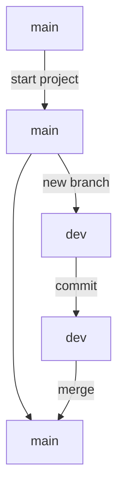

# MARKDOWN

Markdown is an easy-to-read, easy-to-write language for formatting plain text. You can use Markdown syntax, along with some additional HTML tags, to format your writing on GitHub, in places like repository READMEs and comments on pull requests and issues.

## MARKUP 
A Markup language is a way of formatting and presenting text data in a different format.

A common use-case for markup language is to present data in HTML.

## MARKDOWN

Markdown is a markup language that provides a shorthand syntax to format information into HTML. Markdown is popular due to easy syntax, and being readable in its raw format.

> [!CAUTION]  
> Do not confuse markup language with markdown:
> - Markup is a general term referring to the process of adding tags to format a document
> - Markdown is a specific lightweight markup language that simplifies this process and is used for creating content on various platforms in a straightforward manner.

Markdown extensions are `.md` and `.markdown`.

The general concept is:
> We write in **Markdown** -> Its transform into HMTL -> An HTML preview is generated

## MARKDOWN BASIC AND EXTENDED SYNTAX

All markdown parsers support the following markdown syntax:

### Headings

To create a heading, add one to six <kbd>#</kbd> symbols before your heading text. The number of <kbd>#</kbd> you use will determine the hierarchy level and typeface size of the heading.

```md
# A first-level heading
## A second-level heading
### A third-level heading
```

> [!TIP]
> With headings GitHub automatically generates a table of contents that you can access. Each heading title is listed in the table of contents and you can click a title to navigate to the selected section.


### Styling text

You can indicate emphasis with bold, italic, strikethrough, subscript, or superscript text in comment fields and `.md` files.

| Style | Syntax | Example | Output |
| --- | --- | --- | --- | 
| Bold | ** ** or __ __ | `**This is bold text**` |	**This is bold text** |
| Italic | * * or _ _ |	`*This text is italicized*` |	*This is bold text* |
| Strikethrough | ~~  ~~ | `~~This was mistaken text~~` |	~~This was mistaken text~~ |
| Bold and nested italic | ** ** and _ _ |	`**This text is _extremely_ important**` | **This text is _extremely_ important** |
| All bold and italic | *** *** | `***All this text is important***` | ***All this text is important*** |
| Subscript | <sub> </sub> | `This is a <sub>subscript</sub> text` | This is a <sub>subscript</sub> text |
| Superscript | <sup> </sup> | `This is a <sup>superscript</sup> text` | This is a <sup>superscript</sup> text |


### Quoting text or blockquote

You can quote text with a <kbd>></kbd> for example `> Text that is a quote`

> Text that is a quote

### Quoting code inline

You can call out code or a command within a sentence with single backticks <kbd>`</kbd> at the start and the end.

`For example this is inline-code`


### Quoting code block
To start and the block put 3 <kbd>`</kbd> together.

```
This is a block code
```

> [!IMPORTANT]  
> By writting the extension file in the first 3 <kbd>`</kbd> the bloc its colored if code mach the extension file.

```py
print("This it python code" )
```

### Links

You can create an inline link by wrapping link text in brackets <kbd>[ ]</kbd>, and then wrapping the URL in parentheses <kbd>( )</kbd>, it will look like this [GitHub Docs](https://docs.github.com/)

`This repo was built using [GitHub Docs](https://docs.github.com/).`

### Relative links

You can define relative links and image paths in your rendered files to help readers navigate to other files in your repository.

The path of the link will be relative to the current file. Links starting with <kbd>/</kbd> will be relative to the repository root. You can use all relative link operands, such as <kbd>./</kbd> and <kbd>../</kbd>.

For example [Readme of this repo](README.md), the syntax is `[Readme of this repo](README.md)`


### Images

To use a image its very similar to a link, just add <kbd>!</kbd> at the start

The syntax is ``


### Horizontal Ruler

A quick and easy way organize and separe sections of is using `---`, this generate a line in the file.

---


### Lists
You can make an unordered list by preceding one or more lines of text with <kbd>-</kbd>, <kbd>*</kbd>, or <kbd>+</kbd>.

```md
- Item
* Item
+ Item
```

<details>
  <summary>Will look like this:</summary>

- Item
* Item
+ Item
</details>

----

To order your list, precede each line with a number (if number are repeate it will autocorrect).
```md
1. First item
2. Second item
2. Third item
```

<details>
  <summary>Will look like this:</summary>

1. First item
2. Second item
2. Third item
</details>

----

### Nested Lists

You can create a nested list by indenting one or more list items below another item.
```
1. First list item
   - First nested list item
     - Second nested list item
```

<details>
  <summary>Will look like this:</summary>

1. First list item
    - First nested list item
        - Second nested list item
</details>

----

### Tables

You can create tables with pipes | and hyphens -. Hyphens are used to create each column's header, while pipes separate each column. You must include a blank line before your table in order for it to correctly render.

```md
| Header | Header |
| --- | --- |
| Cell | Cell |
```

<details>
  <summary>Will look like this:</summary>

| Header | Header |
| --- | --- |
| Cell | Cell |
</details>

----


You can use formatting such as links, inline code blocks, and text styling within your table.

You can align text to the left, right, or center of a column by including colons : to the left, right, or on both sides of the hyphens within the header row.
```md
| Left-aligned | Center-aligned | Right-aligned |
| :---         |     :---:      |          ---: |
| Cell | Cell | Cell |
```

<details>
  <summary>Will look like this:</summary>

| Left-aligned | Center-aligned | Right-aligned |
| :---         |     :---:      |          ---: |
| Cell | Cell | Cell |
</details>

----

### Paragraphs
You can create a new paragraph by leaving a blank line between lines of text.

### Footnotes
You can add footnotes to your content by using this bracket syntax.

```md
Here is a simple footnote[^1].

A footnote can also have multiple lines[^2].

[^1]: My reference.
[^2]: To add line breaks within a footnote, prefix new lines with 2 spaces.
  This is a second line.
```

> [!NOTE]  
> The position of a footnote in your Markdown does not influence where the footnote will be rendered. You can write a footnote right after your reference to the footnote, and the footnote will still render at the bottom of the Markdown.


### Emojis
You can add emoji to your writing by typing <kbd>:EMOJICODE:</kbd>, a colon followed by the name of the emoji.

`:mate:` look like this :mate:


### Definition Lists

The Definition Lists extension adds the ability to create definition lists in
Markdown documents.

```md
Apple
:   Pomaceous fruit of plants of the genus Malus in
    the family Rosaceae.

Orange
:   The fruit of an evergreen tree of the genus Citrus.
```


<details>
  <summary>Will look like this:</summary>

<dl>
<dt>Apple</dt>
<dd>Pomaceous fruit of plants of the genus Malus in
the family Rosaceae.</dd>

<dt>Orange</dt>
<dd>The fruit of an evergreen tree of the genus Citrus.</dd>
</dl>
</details>

----

### Task lists

To create a task list, preface list items with a hyphen and space followed by <kbd>[ ]</kbd>. To mark a task as complete, use <kbd>[x]</kbd>.

```md
 - [x] https://github.com/Andresmup/recursos-analisis-datos/pull/1
 - [ ] https://github.com/Andresmup/recursos-analisis-datos/pull/2
 - [ ] Complete markdown readme
```

<details>
  <summary>Will look like this:</summary>

 - [x] https://github.com/Andresmup/recursos-analisis-datos/pull/1
 - [ ] https://github.com/Andresmup/recursos-analisis-datos/pull/2
 - [ ] Complete markdown readme
</details>

----

> [!IMPORTANT]  
> If you want to refer to a issue or pull request in the same repo just use # follow by the number. If the issue or pull request is in other repo put the full link.

### Mentioning people and teams

You can mention a person or team on GitHub by typing <kbd>@</kbd> plus their username or team name. This will trigger a notification and bring their attention to the conversation. People will also receive a notification if you edit a comment to mention their username or team name. 


```md
@Andresmup make this repo.
``` 

> [!NOTE]  
> A person will only be notified about a mention if the person has read access to the repository and, if the repository is owned by an organization, the person is a member of the organization.


### Comment

You can use HTML comment syntax to add a comment that will be hidden in the output.

```html
<!-- This is a comment -->
```

<details>
  <summary>Will look like this (nothing):</summary>

<!-- This is a comment -->  
</details>

----

## TEXT FORMATTING TOOLBAR

Every comment field on Github contains a text formatting toolbar, which allows you to format your text without learning Github-flavored Markdown syntax.

In addition to Markdown formatting like bold and italic styles and creating headers, links, and lists, the toolbar includes GitHub-specific features such as @-mentions, task lists, and links to issues and pull requests.

> [!NOTE]  
> Most of the times with the text formatting toolbar a preview option will appear to turn the raw markdown format into the final HTML render view.


### Enabling fixed-width fonts in the editor

You can enable a fixed-width font in every comment field on GitHub. Each character in a fixed-width, or monospace, font occupies the same horizontal space.

This can make it easier to edit advanced Markdown structures such as tables and code snippets.

> [!TIP]
> Go to Settings -> Appearance -> Under "Markdown editor font preference" -> Select **Use a fixed-width (monospace) font when editing Markdown.**


## SLASH COMMANDS

Slash commands can save you time by reducing the typing required to create complex Markdown.

Slash commands (within comment boxes) on Github.com provides convenience features such as formatting markdown. You can use slash commands in any description or comment field in issues, pull requests, or discussions where that slash command is supported


### Using slash commands
You can use slash commands by typing the command in a comment field, then following the prompts. To insert complex Markdown into your comment, type one of the following commands.

| Command |	Description |
| --- | --- |
| <kbd>/code</kbd> | Inserts a Markdown code block. You choose the language. |
| <kbd>/details</kbd> | Inserts a collapsible detail area. You choose the title and content. |
| <kbd>/saved-replies</kbd> | Inserts a saved reply. You choose from the saved replies for your user account. If you add `%cursor%` to your saved reply, the slash command will place the cursor in that location. |
| <kbd>/table</kbd> | Inserts a Markdown table. You choose the number of columns and rows. |
| <kbd>/tasklist</kbd> | Inserts a tasklist. This slash command only works in an issue description. |
| <kbd>/template</kbd> | Shows all of the templates in the repository. You choose the template to insert. This slash command will work for issue templates and a pull request template. |


## GITHUB FLAVOURED MARKDOWN

GitHub Flavored Markdown (GFM), **is the dialect of Markdown** that is currently supported for user content on GitHub.com and GitHub Enterprise.

GMF provides powerfull functionality:
 - Collapsable sections
 - Embed mathematical expresions
 - Embed diagrams
 - Relatived paths or linking to files in the same repo
 - Task lists can be converted into issues
 - Extended formatting for tables
 - Shorthands to autolink to issues, pull request and repos
 - Render code snippets from other codebases via linking

Some GFM features that are updrages from markdown are:
 - Support embedded syntax within tables
 - Support advance cell alignment
 - The `<details>` tag can be used to create collapsable sections

### Mermaid
Mermaid is a Mardown-inspired tool that renders text into diagrams, which is really useful to render flow charts, sequence diagrams, pie charts and more.

To create a Mermaid diagram, add Mermaid syntax inside a fenced code block with the `mermaid` language identifier.


```md
graph TD
    A[main] -->|start project| B[main]
    B[main] --> C[main]
    B[main] -->|new branch| D[dev]
    D[dev] -->|commit| E[dev]
    E[dev] -->|merge| C[main]
```



### GeoJSON or TopoJSON

You can use GeoJSON or TopoJSON syntax to create interactive maps. To create a map, add `GeoJSON` or `TopoJSON` inside a fenced code block with the geojson or topojson syntax identifier. 

### STL 3D models

You can use ASCII STL syntax directly in markdown to create interactive 3D models. To display a model, add ASCII STL syntax inside a fenced code block with the `stl` syntax identifier. 

### LaTeX

To enable clear communication of mathematical expressions, GitHub supports LaTeX formatted math within Markdown.

GitHub's math rendering capability uses MathJax; an open source, JavaScript-based display engine. MathJax supports a wide range of LaTeX macros, and several useful accessibility extensions.

Mathematical expressions rendering is available in GitHub Issues, GitHub Discussions, pull requests, wikis, and Markdown files.

There are two options for delimiting a math expression inline with your text. You can either surround the expression with dollar symbols <kbd>$</kbd>, or start the expression with <kbd>$\`</kbd> and end with <kbd>\`$</kbd>.

To add a math expression as a block, start a new line and delimit the expression with two dollar symbols <kbd>$$</kbd>.


Alternatively, you can use the <kbd>```math</kbd> code block syntax to display a math expression as a block. With this syntax, you don't need to use <kbd>$$</kbd> delimiters.