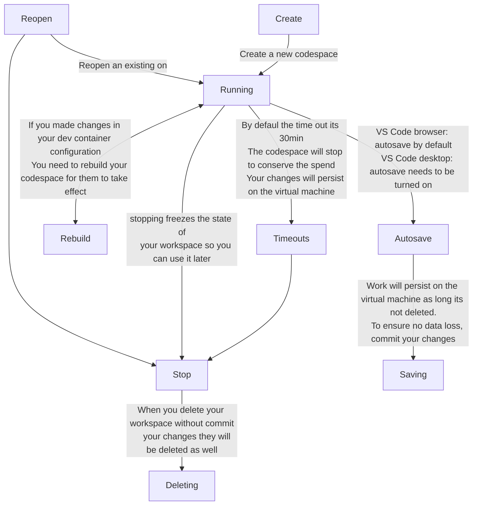

# CODESPACES

Github Codespaces is a Cloud Developmnent Environment (CDE) integrated with your Github repo. An enviroment is know as a codespaces.

A codespaces run:
- In Ubuntu Linux docker container
  - On a virtual machine
    - Hosted and managed by Gihub

Your codebase will be cloned into `/workspaces`

> [!IMPORTANT]  
> If you plan to use codespaces remember:
> - Free plan account has 120 core hours, or 60 hours of run time for a 2 core codespace, plus 15 GB of storage to use each month.
> -  Pro accounts get 180 core hours and 20 GB storage per month. 

## INTERACT 

There are 2 main ways to interact with codespaces

### Command line

Using SSH via Github CLI


The Github CLI commands avalaible for Codespaces:
- gh codespace code
- gh codespace cp
- gh codespace create
- gh codespace delete
- gh codespace edit
- gh codespace jupyter
- gh codespace list
- gh codespace logs
- gh codespace ports
- gh codespace rebuild
- gh codespace ssh
- gh codespace stop
- gh codespace view


### Code editors
The options are:
- VS Code Desktop
  - Connect to the cloud from your local desktop client. In the VS Browser you can tell it to connect this codespace. To your locally installed VS Code
- VS Code Browser
  - Edit and preview changes straight from the browser.
- JetBrains Gateway IDE
  - Connect to the cloud from your local desktop client.
- JupyterLab
  - Edit and run notebooks from the browser with JupyterLab.


## CREATE CODESPACES

When you create a new codespacesyou choose:
- The repo
- The branch
- The region, can be:
  - US East
  - US West
  - Europe West
  - Southeast Asia
  - Australias
- Machine type, define capacity of the virtual machine (ram and memory):
  - 2-Core (8GB Ram, 32GB)
  - 4-Core (16GB Ram, 32GB)
  - 8-Core (32GB Ram, 64GB) <ins>requires some payment mode linked to the account</ins>
  - 16-Core (32GB Ram, 128GB) <ins>requires some payment mode linked to the account</ins>


You can see all of your codespaces across all your repos at https://github.com/codespaces

You can start a Codespace in the Github UI repo via the <kbd>Code</kbd> section in the <kbd>Codespaces</kbd> tab

You can also use the Github CLI to create a codespace
```sh
gh codespace create
gh codespace open
```

> [!NOTE]  
> The is a limit of current codespaces allow to run. If you hit the limit you may need to stop other codespaces first.

## CODESPACE LIFECYCLE



## RENAME
When you create a codespace it's assigned an auto-generated display name.

You can rename the auto-generated name in the case you have multiple codespaces to easily identify the purpose or state of your codespace.

You can see all of your codespace at https://github.com/codespaces

## VS CODE CONFIGURATIONS

Github Codespaces should persist your VS Code settings that you change in your codespace.

When you edit Settings in the UI you are actually modifying a settings.json file. It get synced and backed up hosted by Github.

You can override setting.json options in your devcontainer.json file

### Extensions

VS Codespaces should persist you VSC extensions that you change in codespaces.

Most VSC Marketplace extensions are available to install in VSC Browser for Github Codespaces. You can ensure your extensions reliably load everytime by setting them in your devcontainer.json

### Theme
Github Codespaces should persist your VSC theme that you change in codespaces.

User interface decorators or themes are personal choices that should no be put in the devcontainer.json file

### Retention period and Timeout
Under  Github Settings -> Codespaces you can change the timeout and retention period.

IDLE timeout defines how long should codespaces wait to stop when their has been no activity.
- Minimum: 5 min
- Maximum: 240 min (4 h)
- Default: 30 min

Retention period defines how many days of codespace inactivity should pass until auto deletion.
- Minimum: 0 d
- Maximum: 30 d
- Default: 30 d

### Sync settings
By enabling settings sync, your codespaces will be able to pull from VSC Settings Sync Service.

VSC Settings Sync lets you share your VSC configuration such settings, keybindings, and installed extensions across your machines so the are always working with your favourite setup.

### Dotfiles

You can configure Github Codespaces to use dotfiles from a specific repository that will be used for all future codespaces you start.

When you create a new codespace with this feature, Github does:
1. Github clones your selected dotfiles repository to the codespace enviroment.
2. Looks for one of the following files to set up the enviroment.
   - install.sh
   - install
   - bootstrap.sh
   - bootstrap
   - script/bootstrap
   - setup.sh
   - setup
   - script/setup

## DEEP LINK

Github Codespaces Deep Link is an easy way to generate a sharable link that will launch a Codespace for a specific repo.

Here is an example
https://codespaces.new/Andresmup/github-foundations

You will have to define branch, region and machine type before Creating it.

The posible snippets are:
 - URL
 - HTML
 - Markdown

## SECRETS

Development environment secrets are environment variables that are encrypted. They are available to any codespace you create using repositories with access to that secret.

Secrets allows you to set sensitive enviroment variables that will be loaded into your codespace. This avoid hardcoding secrets, passwords and sensitive values into your codebase.


## DEVCONTAINER.JSON

VSC Dev Containers allows you to configure your Docker container via json file.

devcontainer.json file is expected in the root of yor project.

You can provide a base image from a repo.

You can build your own image by including the Dockerfile with your project.

`"features":` allows you to quickly install programs on top of a common base image.

To custom configure your program generally you will install these via your custom Dockerfile.

You could use the `"postCreateCommand":` to install a bunch of programs on top of your base container.

> You can create your own features to quickly install on top of your own base image.

`"settings":` allows you to configure the settings of VS Code.

`"extensions":` allows you to install VSC extensions

`"forwardPorts":` allows to list ports you want to forward

`"runArgs":` allow to command flags and their values we want to pass with docker run commands

`"containerEnv":` is used to pass enviroment variables we want to pass to the running container 

`"mounts":` allows you to map files and folders to your containers

some use case are:
- Bind Mount a Local Directory: Mount a local directory for direct file access
- Mount a Docker Volume Persistent Storage: Use a docker volume data that persist across container rebuilds
- Mount a Docker Socket: Allow the container to interact with the host's Docker daemon
- Mount a Specific File: Mount a specific configuration file into the container
- Mount a Host Directory as ReadOnly: Mount a directory from the host as read-only

`"postCreateCommand":` its the command that runs after creating the container. Allowing to install programs on top of your base container.

`"remoteUser":` its the default username that VSC should use when connecting to the container

## CHANGING SHELL

Github Codespaces VSC Browser default devcontainer image come with:
- Bash (default)
- Zsh
- Fish

If you build or provide an image to devcontainer.json with other shells installed you can define and provide the path to that shell for use.

You can configure the settings.json in VSC to change the defaults base on operating system.

## GITHUB.DEV EDITOR

**Github.dev Editor is a VSC browser that instantly loads that has no attached compute.**

Github.dev Editor is intended for quickly changes to the file and commiting code in a IDE experience.

The are 2 main ways to access it:
- Press the period <kbd>.</kbd> hotkey on your keyboard when you have your Github Repository page opened in the browser.
- Place your Repo Path after the URL (https://github.dev/Andresmup/github-foundations)


## CODESPACES VS DEV EDITOR COMPARISON

| Feature | Github.dev editor | Codespaces |
| --- | --- | --- |
| Cost | Free | Has a free montly quota. Can charge base on Storage and Core hours per month (base on machine type) |
| Availability | Available for everyone on Github | Available for everyone on Github |
| Start up | Instantly launches. No devcontainer.json configuration | Takes a few minutes to start up. Does load devcontainer.json |
| Compute | There is no attached compute. You can't run code or apps | Dedicated attached VM. Run and debug your code and apps |
| Terminal access | No terminal | Terminal access |
| Extensions | Limited subset of extensions | Most extensions from VSC marketplace available |